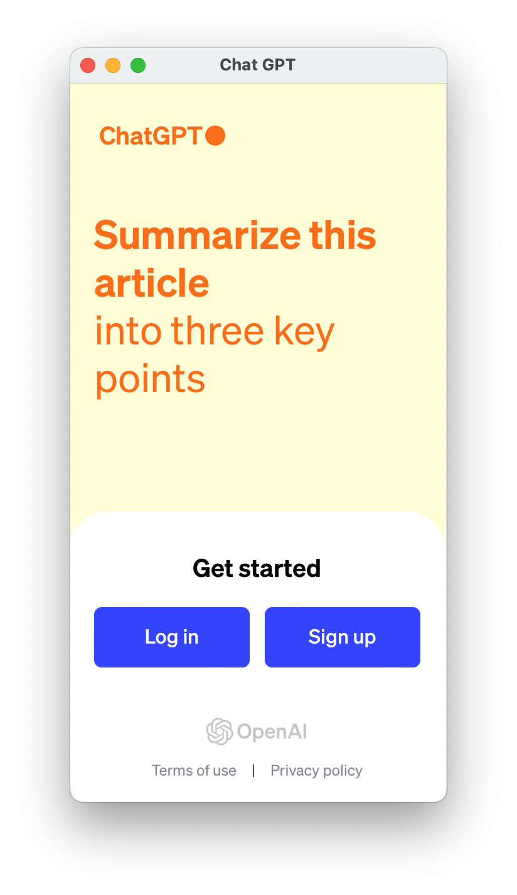

# AI-Chat
AI-Chat

This is a widget program that works like a widget and looks like a widget, sits on the desktop, and provides one-click access to Chat GPT Web.

The widget remembers its last location, and the next time it starts, it will be at that location.

The widget itself is quite easy to use, you need to move it to the rest of the programs, go to the settings (General -> Login Items -> Open at Login -> press "+" and add the program to the start). that's it, every time you start the computer, the widget will be in its place.

1) Widget

2) Web interface

